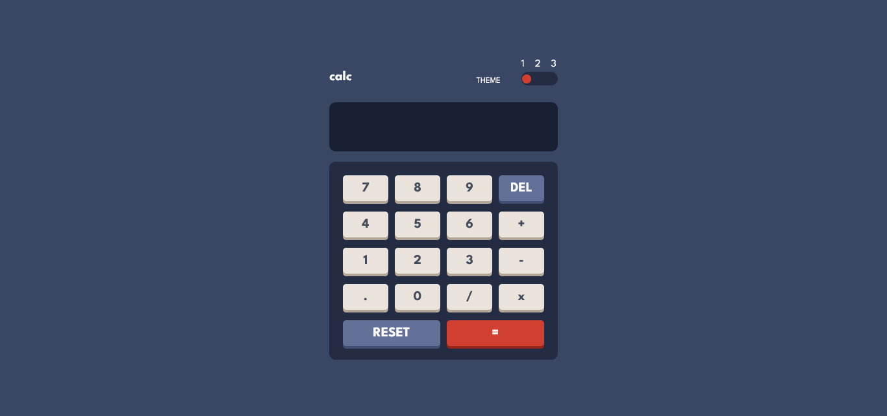

# Frontend Mentor - Calculator app solution

This is a solution to the [Calculator app challenge on Frontend Mentor](https://www.frontendmentor.io/challenges/calculator-app-9lteq5N29). Frontend Mentor challenges help you improve your coding skills by building realistic projects.

## Table of contents

- [Overview](#overview)
  - [The challenge](#the-challenge)
  - [Screenshot](#screenshot)
  - [Links](#links)
- [My process](#my-process)
  - [Built with](#built-with)
  - [Continued development](#continued-development)
- [Author](#author)

## Overview

### The challenge

Users should be able to:

- See the size of the elements adjust based on their device's screen size
- Perform mathmatical operations like addition, subtraction, multiplication, and division
- Adjust the color theme based on their preference
- **Bonus**: Have their initial theme preference checked using `prefers-color-scheme` and have any additional changes saved in the browser

### Screenshot

### Links

[solution URL](https://github.com/Malik-Muhammed/calculator)
[live site URL](https://malik-muhammed.github.io/calculator/)

## My process

### Built with

- Semantic HTML5 markup
- CSS nesting
- CSS Grid
- Mobile-first workflow
- [decimal.js](https://www.npmjs.com/package/decimal.js/v/10.4.3) - JS library

### Continued development

While I have embarked on this challenge and provide solutions to the best of ability,
I will continue to learn and look for ways to my layout approach and improving on my knowledge of
JavaScript Fundamentals

## Author

- Frontend Mentor - [@Malik-Muhammed](https://www.frontendmentor.io/profile/Malik-Muhammed)
- Twitter - [@maliqlanre](https://www.twitter.com/maliqlanre)
